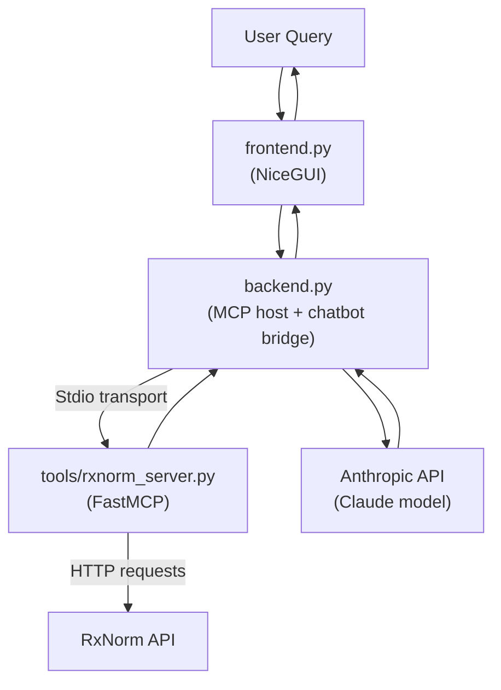

# 🩺 med_find – Medical Finder (MCP + NiceGUI)

This project is a demo of an **MCP-enabled chatbot** that can query the **RxNorm drug database** through an MCP server, with a **NiceGUI frontend**.  
It supports **local desktop testing** (using NiceGUI’s native window) and **deployment to Railway** (web server mode). It is available online at https://medicalprojectdeploy-production.up.railway.app/

---

## 📂 Project structure

```
medical_project_deploy/
├── frontend.py          # NiceGUI frontend (entrypoint for Railway)
├── backend.py           # MCP host + chatbot bridge
├── server_config.json   # Defines MCP servers to launch
├── tools/
│   └── rxnorm_server.py # MCP server for RxNorm API (FastMCP)
├── requirements.txt     # Python dependencies
└── README.md            # Project overview & instructions
```

---

## 🚀 Running locally (PyCharm, venv, etc.)

1. **Clone the repo**
   ```bash
   git clone https://github.com/<your-username>/<your-repo>.git
   cd medical_project_deploy
   ```

2. **Create & activate a virtual environment**
   ```bash
   python -m venv .venv
   source .venv/bin/activate      # Linux / macOS
   .venv\Scripts\activate       # Windows PowerShell
   ```

3. **Install dependencies**
   ```bash
   pip install -r requirements.txt
   ```

4. **Set your Anthropic API key**  
   Create a `.env` file in the project root:
   ```
   ANTHROPIC_API_KEY=your_api_key_here
   ```

5. **Run the app**
   ```bash
   python frontend.py
   ```
   - Locally → opens a **native desktop window** (requires `pywebview`)  
   - If `pywebview` is not installed, you can run in browser mode instead:
     ```python
     ui.run(host="0.0.0.0", port=8080)
     ```

---
## ⚙️ Configuration notes

- **server_config.json**  
  Uses `python` to start the RxNorm MCP server:
  ```json
  {
    "mcpServers": {
      "rxnorm": {
        "command": "python",
        "args": ["tools/rxnorm_server.py"]
      }
    }
  }
  ```

- **Requirements**  
  ```txt
  nicegui
  anthropic
  mcp
  python-dotenv
  requests
  # pywebview (optional for local native mode)
  ```

---

## 📖 Usage

1. Launch the app (locally or via Railway)  
2. Enter a drug name or RxCUI in the input box  
3. The chatbot may call the **RxNorm MCP server** to retrieve drug info  
4. Responses are displayed in the scrollable output area

---

## 🛠️ Troubleshooting

- **Error: “Native mode is not supported…”**  
  → Run `pip install pywebview`, or fall back to browser mode.

- **No response from RxNorm server**  
  → Check `server_config.json` path (`tools/rxnorm_server.py`) and make sure `requests` is installed.

- **Anthropic API key error**  
  → Ensure `ANTHROPIC_API_KEY` is set in `.env` (local) or Railway Variables (deploy).

---

## 🖼️ Architecture diagram



This shows the full flow:
- User interacts with **NiceGUI frontend**
- Queries are passed to the **MCP host backend**
- Backend may call:
  - **Anthropic API** for LLM reasoning
  - **RxNorm MCP server** for structured drug data
- Responses flow back to the user
